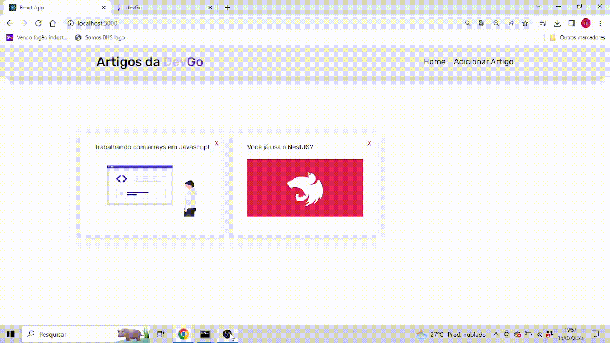

<h1 align="center">
  
</h1>

# Teste Devnology

<p align="center">
  <a href="https://github.com/nataxaa">
    
  </a>

  <a href="#">
    
  </a>

  <a href="https://github.com/nataxaa/BarberShop/commits/master">
    
  </a>

  <a href="#">
    
  </a>

</p>

<br />

## 💻 Projeto

Projeto feito em react e node. Exercício bem básico a única dificuldade foi hospedar o backend e infelizmente não consegui, mas deixei o processo de instalação embaixo. Como web crawler utilizei puppeteer para automatizar o acesso dos dados. No frontend usei react, styled-components, css, html, axios. No backend express, controllers, models, sqlite, prisma.

<br />foi 

## 🌐 Preview

<h1 align="center">
    
</h1>

## 🚀 Tecnologias

Esse projeto foi desenvolvido com as seguintes tecnologias:

- [Typescript](https://www.typescriptlang.org/)
- [Styled Components](https://styled-components.com/)
- [React](https://pt-br.reactjs.org/)
- [Node](https://nodejs.org/en/)

<br />

## 🔥 Instalação
```bash
Acessar pasta frontend e :
$ yarn
$ yarn start

Acessar pasta backend e :
$ npm
$ npm start
```
<br/>


<p align="center">
  Made with 💙 by <a href="https://www.linkedin.com/in/natan-xavier-a266a0228/"> Natan Xavier </a>
</p>
